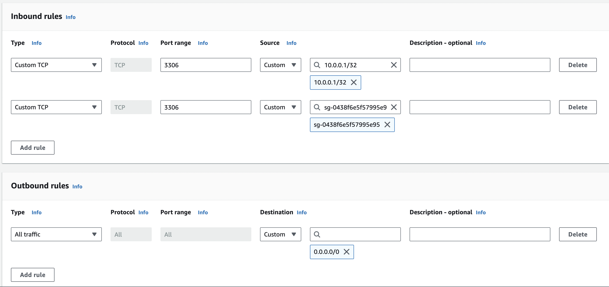

### TransferGo Tasks

#### 1. Provide AWS bucket policy in JSON format (and your comments about it) to allow only secure access for

    1. User with arn:aws:iam::123456789012:user/John - to Get and Put objects in path with prefix jonhs_files/
    2. All users and roles from AWS account 333456789333 should have full access to bucket
    3. Role arn:aws:iam::123456789012:group/Developers - must have only GetObject access to objects with path prefix developer/

**Answer**: Can be found inside s3-policy.json

#### 2. Describe (in text form) security group configuration for a managed AWS RDS MySQL 8.0 database which is only access by a single instance application with IP address 10.0.0.1 and security group id sg-02ce123456e7893c7 assigned to the application instance.

**Answer**: Terraform configuration file can be found in (rds-mysql.tf) and also image indicating how it would look like in AWS.

#### 3. What solution (described in text form) would you recommend for application in AWS Account A to securely access AWS SQS queue in AWS Account B?

**Answer**: Update the SQS queue resource based policy to allow actions from the other account, then configure IAM policies in the accessing account to allow necessary SQS actions. Here is how it could be done:

1. Update SQS Queue Policy in Account B (policy is in account-b-sqs-policy.json).

- Modify the SQS queue policy to explicitly grant access to the IAM entities in Account A that need to interact with the queue. This involves adding a permission statement that allows sqs:SendMessage, sqs:ReceiveMessage, or other required actions. Add SQS queue policy(account-b-sqs-policy.json) in Account B.

2. Configure IAM Policies in Account A (policy is in account-a-sqs-policy.json).

- In Account A, attach an IAM policy to the user or role that needs access to the SQS queue in Account B. Enables them to perform actions like sqs:SendMessage or sqs:ReceiveMessage on the specific queue. Add example IAM policy in Account A(account-a-sqs.policy.json).

#### 4. Describe (either in text form or high level solution picture) how would you securely expose to the Internet an Application running in AWS without a public IP address assigned? Application is already running with an ip address 10.0.0.1 and is able to serve HTTP traffic on port 80.

**Answer**: To securely expose an application running in AWS without public IP address assigned, I would use ALB(Application Load Balancer). Steps to securely expose application:

1. Create an ALB and configure it to listen on HTTP (port 80).
2. Set up a target group for the ALB that includes the instance running the application as its target. The ALB will route traffic to it using private IP addresses within the VPC.
3. Configure the ALB with a public subnet that has a route to the Internet Gateway (IGW) or a NAT Gateway if the ALB needs to reach the internet.
4. The ALB acts as the entry point for internet traffic to your application, enabling it to be accessible over the internet.

You could also complete these additional steps in order to  make the connection more secure: adding Security Group to ALB, Health Check, configuring DNS, ACM(Certificate Manager).